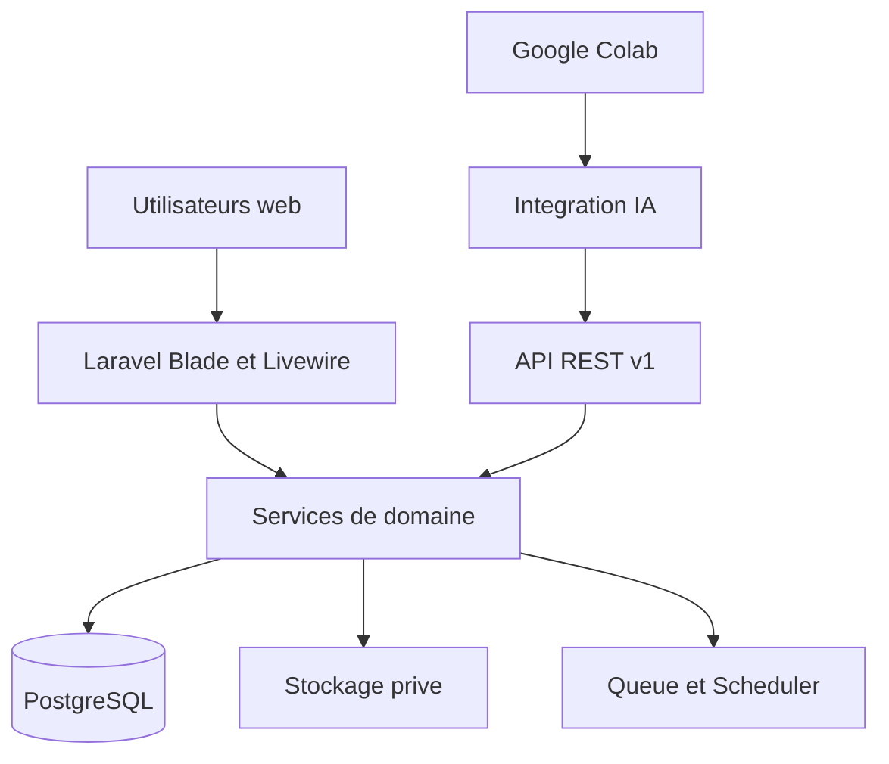

# RentFleet - Cahier d'architecture executable pour Codex

**Projet :** PFE Master Sciences des Donnees  
**Sujet :** Systeme intelligent d'optimisation et de gestion predictive des flottes de vehicules de location  
**Duree maximale :** 45 jours calendaires  
**Statut :** architecture de reference verrouillee pour le developpement  

---

## 1. Objet du document

Ce document est la reference de developpement de RentFleet. Il doit etre place a la racine du depot et lu par Codex avant toute modification importante.

La priorite absolue est de disposer, a tout moment, d'une version demonstrable du cycle suivant :

> client -> reservation -> contrat -> depart -> retour -> frais/dommage -> paiement -> cloture

L'intelligence artificielle enrichit ce cycle mais ne doit jamais conditionner son fonctionnement.

En cas de contradiction avec un ancien document du PFE, les decisions du present cahier priment pour le code. Les regles juridiques, fiscales et sociales sont des aides configurables et ne doivent jamais etre presentees comme un service officiel de declaration ou de conseil.

---

## 2. Decisions techniques verrouillees

| Domaine | Decision | Justification |
|---|---|---|
| Architecture | Monolithe modulaire Laravel | Rapidite, transactions simples, deploiement et demonstration fiables |
| Base | PostgreSQL | Contraintes, index, JSONB cible et protection contre les chevauchements |
| Frontend | Blade + Livewire cible + Tailwind CSS | Interface moderne sans cout d'une SPA |
| API | REST JSON versionnee sous `/api/v1` | Integrations IA et futures sans doubler toute l'interface |
| Multitenance | Base partagee, isolation par `tenant_id` | Implementation soutenable et facile a demontrer |
| Fichiers | Disque prive Laravel, telechargement controle | Protection des documents d'identite et contrats |
| Taches asynchrones | Queue Laravel avec pilote base de donnees | Pas de dependance Redis obligatoire |
| Planification | Laravel Scheduler | Alertes, echeances, scores et archivage |
| IA | Colab pour entrainement, Laravel pour inference/import | Separation claire entre recherche et produit |
| Tests | PHPUnit/Pest selon le socle installe, tests fonctionnels prioritaires | Validation continue des risques critiques |
| Deploiement | Une application web + PostgreSQL + stockage prive | Architecture reproductible pour la soutenance |

### 2.1 Interdictions de perimetre avant la release candidate

Ne pas introduire :

- microservices ;
- React, Vue ou une SPA complete ;
- Kafka, Spark, blockchain ou Kubernetes ;
- IoT ou GPS materiel reel ;
- moteur de paie ou comptabilite generale ;
- paiement bancaire reel ;
- signature electronique qualifiee externe ;
- application mobile ;
- plus d'un modele ML tant que le premier n'est pas integre et teste.

---

## 3. Principes de construction

### 3.1 Vertical slices

Chaque lot doit produire un flux utilisable comprenant, selon le besoin : migration, modele, autorisation, validation, service metier, controleur ou composant Livewire, vues, tests et donnees de demonstration.

Un CRUD sans regles metier ni tests n'est pas considere termine.

### 3.2 Simplicite explicite

- Utiliser les fonctions natives de Laravel avant d'ajouter un package.
- Ne pas creer d'abstraction sans au moins deux usages reels.
- Utiliser des enums PHP pour les statuts stables.
- Garder les montants en `numeric(14,2)` et jamais en `float`.
- Garder les dates metier en `date` et les evenements en `timestamp with time zone`.
- Utiliser des colonnes relationnelles pour les informations critiques.
- Limiter JSONB aux parametres et snapshots flexibles.
- Conserver les decisions sensibles dans un journal d'audit.

### 3.3 Definition globale de termine

Une fonctionnalite est terminee lorsque :

1. la migration est reversible ;
2. les contraintes et index pertinents existent ;
3. les donnees sont filtrees par tenant cote serveur ;
4. les autorisations sont testees ;
5. les erreurs sont compréhensibles dans l'interface ;
6. le chemin nominal et au moins un cas d'erreur sont testes ;
7. les seeders permettent une demonstration ;
8. la documentation et le journal de decisions sont actualises ;
9. aucun secret ni document sensible n'est publie ;
10. la suite de tests critique reste verte.

---

## 4. Architecture logique



### 4.1 Modules du monolithe

Le code reste une seule application, organisee par domaines :

1. Identity : authentification, utilisateurs, roles et permissions.
2. Tenancy : societes, agences, contexte tenant et parametres.
3. Fleet : categories, vehicules, statuts et disponibilite.
4. CRM : clients, conducteurs, identites et incidents.
5. Pricing : tarifs, options, cautions et versions.
6. Booking : reservations et blocs de disponibilite.
7. Rental : contrats, acceptations, depart, retour et cloture.
8. Inspection : inspections, photos et dommages.
9. Maintenance : interventions, couts et immobilisations.
10. Insurance : polices, garanties, echeances et sinistres simples.
11. Billing : paiements, cautions, factures simples et depenses.
12. Documents : fichiers prives, versions, acces et conservation.
13. Compliance : calendrier configurable et preuves documentaires.
14. Intelligence : regles, scores, alertes, modeles et predictions.
15. Reporting : tableaux de bord, KPI et exports.
16. Audit : historique des actions critiques.

Les modules communiquent par services applicatifs et evenements Laravel lorsque cela apporte une valeur concrete. Ils ne deviennent pas des packages Composer separes pendant le PFE.

### 4.2 Structure Laravel recommandee

```text
app/
  Domain/
    Tenancy/
    Fleet/
    CRM/
    Pricing/
    Booking/
    Rental/
    Inspection/
    Maintenance/
    Insurance/
    Billing/
    Documents/
    Compliance/
    Intelligence/
    Reporting/
  Enums/
  Http/
    Controllers/
      Api/V1/
      Web/
    Middleware/
    Requests/
  Livewire/
  Models/
  Policies/
  Jobs/
  Console/Commands/
  Support/
database/
  factories/
  migrations/
  seeders/
docs/
  adr/
  api/
  diagrams/
  evidence/
resources/views/
routes/
tests/
  Feature/
  Unit/
```

Les modeles Eloquent peuvent rester sous `app/Models`. La logique qui modifie plusieurs entites doit etre placee dans un service de domaine nomme par action, par exemple `ConfirmReservation`, `OpenRentalContract`, `CompleteVehicleReturn`.

---

## 5. Multitenance et autorisation

### 5.1 Modele organisationnel

- Un `tenant` represente une entreprise cliente du SaaS.
- Un tenant possede une ou plusieurs `agencies`.
- Un utilisateur metier appartient a un tenant et peut etre limite a une agence.
- Un super-administrateur de plateforme n'appartient pas a un tenant et utilise des routes separees.

### 5.2 Invariants obligatoires

1. Toute table metier contient un `tenant_id` non nul.
2. Toute entite operationnelle contient `agency_id` lorsque le site est pertinent.
3. `tenant_id` n'est jamais accepte depuis une requete utilisateur ou un fichier importe.
4. Le contexte tenant est determine apres authentification et injecte cote serveur.
5. Les policies verifient tenant, agence, permission et etat metier.
6. Les routes super-administrateur sont separees des routes metier.
7. Les telechargements passent par un controleur autorise.
8. Les relations critiques utilisent des contraintes garantissant l'appartenance au meme tenant.
9. Les index de recherche metier commencent par `tenant_id`.
10. Des tests tentent la lecture, modification, suppression et telechargement cross-tenant.

### 5.3 Implementation recommandee

- Middleware `ResolveTenantContext` apres l'authentification.
- Objet immuable `TenantContext` expose par le conteneur Laravel.
- Trait Eloquent `BelongsToTenant` appliquant un global scope et renseignant le tenant a la creation.
- Exception explicite si aucun contexte tenant n'existe pour une route metier.
- Methodes `forTenant()` uniquement pour les taches systeme controlees.
- Aucune possibilite de changer de tenant avec un parametre de requete standard.

Le global scope ne remplace ni les policies, ni les contraintes de base, ni les tests.

---

## 6. Roles et permissions

### 6.1 Roles initiaux

| Role | Responsabilite principale |
|---|---|
| Super Admin | Administration technique de la plateforme, sans utilisation quotidienne des donnees metier |
| Tenant Owner | Parametres de la societe, agences, utilisateurs et vision globale |
| Agency Manager | Pilotage d'une agence, contrats, tarifs, flotte et rapports |
| Rental Agent | Clients, reservations, contrats, departs et retours |
| Fleet Manager | Vehicules, inspections, dommages, maintenance et assurances |
| Accountant | Paiements, cautions, factures, depenses et exports |
| Viewer/Auditor | Consultation et audit sans modification |

### 6.2 Groupes de permissions

- `tenant.manage`, `agency.manage`, `user.manage` ;
- `vehicle.view/create/update/archive` ;
- `customer.view/create/update`, `customer.identity.view` ;
- `reservation.view/create/confirm/cancel` ;
- `contract.view/create/accept/start/return/close/cancel` ;
- `inspection.manage`, `damage.manage`, `maintenance.manage` ;
- `insurance.manage` ;
- `payment.view/create/refund`, `invoice.manage`, `expense.manage` ;
- `document.view/upload/download/delete` ;
- `compliance.manage` ;
- `prediction.view/review`, `rule.manage` ;
- `report.view/export`, `audit.view`.

Les permissions sont verifiees par policies. Les boutons caches dans l'interface ne constituent pas une protection.

---

## 7. Modele de donnees et ordre des migrations

### 7.1 Conventions communes

- Identifiants : UUID ou ULID uniformes dans tout le projet ; ne pas melanger les strategies.
- Chaque table : identifiant, dates de creation/modification et, si utile, suppression logique.
- Cle etrangere avec comportement de suppression explicite.
- `created_by` et `updated_by` sur les entites sensibles lorsque l'audit generique ne suffit pas.
- Devise initiale : MAD, mais colonne `currency CHAR(3)` sur les montants contractuels.
- Numeros lisibles generes par tenant : reservation, contrat, facture, maintenance et sinistre.
- Les statuts ne sont jamais modifies directement depuis un formulaire generique.

### 7.2 Vague A - socle

1. `tenants`
2. `agencies`
3. `users`
4. `roles`, `permissions` et tables d'association
5. `tenant_settings`
6. `audit_logs`
7. tables Laravel de jobs, cache et sessions selon la configuration

Contraintes essentielles :

- `agencies`: unique `(tenant_id, code)` ;
- `users`: email unique selon la strategie choisie, appartenance tenant/agence coherente ;
- `tenant_settings`: unique `(tenant_id, agency_id, key, valid_from)`.

### 7.3 Vague B - referentiels

8. `vehicle_categories`
9. `vehicles`
10. `vehicle_status_histories`
11. `customers`
12. `drivers`
13. `customer_incidents`
14. `pricing_rules`
15. `documents`
16. `document_versions`
17. `document_access_logs`

Champs essentiels de `vehicles` : tenant, agence, categorie, immatriculation, VIN facultatif, marque, modele, annee, carburant, transmission, kilometrage, statut, prix journalier indicatif et metadonnees non critiques.

Champs essentiels de `customers` : type personne/societe, nom, contacts, adresse, identifiant protege, statut de verification et notes limitees.

Les copies de CIN et permis sont des documents prives, pas des URLs publiques.

### 7.4 Vague C - reservation et disponibilite

18. `reservations`
19. `reservation_status_histories`
20. `vehicle_blocks`

`vehicle_blocks` est la source de verite de la disponibilite. Un bloc contient : tenant, agence, vehicule, type de bloc, source polymorphique controlee, debut, fin et statut.

Utiliser une contrainte d'exclusion PostgreSQL pour interdire le chevauchement des blocs actifs d'un meme vehicule. La confirmation de reservation doit s'executer dans une transaction et transformer ou creer le bloc correspondant.

### 7.5 Vague D - contrat et cycle de location

21. `rental_contracts`
22. `contract_drivers`
23. `contract_versions`
24. `contract_acceptances`
25. `contract_charges`
26. `contract_status_histories`
27. `vehicle_inspections`
28. `inspection_items`
29. `damage_reports`
30. `damage_status_histories`

Un contrat accepte est verrouille. Une correction cree une nouvelle version ou un avenant ; elle n'ecrase pas silencieusement les conditions acceptees.

Chaque version conserve un snapshot JSONB des conditions, tarifs, options, franchise, caution et politique carburant. Le PDF final conserve une empreinte SHA-256.

### 7.6 Vague E - finance, maintenance et assurance

31. `payments`
32. `deposit_transactions`
33. `invoices`
34. `invoice_lines`
35. `expenses`
36. `maintenance_orders`
37. `maintenance_status_histories`
38. `insurance_companies`
39. `insurance_policies`
40. `insurance_policy_coverages`
41. `insurance_claims`

La caution utilise un registre de mouvements : encaissement, retenue, remboursement et ajustement. Ne pas stocker uniquement un solde modifiable.

### 7.7 Vague F - decisionnel et integration

42. `alerts`
43. `decision_rules`
44. `score_runs`
45. `score_factors`
46. `recommendations`
47. `import_batches`
48. `import_rows`
49. `ml_models`
50. `ml_predictions`
51. `compliance_obligations`
52. `retention_policies`
53. `legal_holds`

Les tables de cette vague ne doivent pas bloquer la fin du cycle de location.

---

## 8. Machines a etats

### 8.1 Reservation

```text
draft -> pending -> confirmed -> converted
                  -> cancelled
                  -> expired
```

Regles :

- seule une reservation `confirmed` bloque fermement un vehicule ;
- une reservation ne peut etre confirmee sans client, conducteur valide, dates coherentes, vehicule disponible et tarif resolu ;
- toute transition produit un historique ;
- `converted` signifie qu'un contrat a ete cree.

### 8.2 Contrat

```text
draft -> ready -> accepted -> active -> return_pending -> closed
            \-> cancelled
```

Regles :

- `accepted` exige une version figee et une trace d'acceptation ;
- `active` exige inspection de depart, kilometrage, carburant et caution traitee selon la politique ;
- `return_pending` exige inspection de retour ;
- `closed` exige calcul final et traitement explicite du solde/caution.

### 8.3 Maintenance

```text
planned -> approved -> in_progress -> completed
                    -> cancelled
```

Une maintenance approuvee ou en cours cree un bloc d'indisponibilite. La cloture met a jour le kilometrage et la prochaine echeance si applicable.

### 8.4 Dommage

```text
reported -> under_review -> customer_responsible
                         -> agency_responsible
                         -> insurance_claim
                         -> dismissed
                         -> resolved
```

Une prediction ou une regle peut proposer une anomalie, mais un utilisateur autorise reste responsable de la decision.

---

## 9. Workflows obligatoires

### 9.1 Reservation

1. Selection de l'agence, des dates et de la categorie.
2. Recherche des vehicules sans bloc chevauchant.
3. Selection ou creation du client et du conducteur.
4. Resolution du tarif actif a la date de depart.
5. Creation en brouillon avec expiration facultative.
6. Confirmation dans une transaction.
7. Creation du bloc vehicule et de l'historique.
8. Generation de la confirmation.

### 9.2 Contrat et depart

1. Conversion de la reservation confirmee.
2. Snapshot des conditions et tarifs.
3. Ajout du conducteur et des documents requis.
4. Inspection de depart et photos.
5. Enregistrement de la caution.
6. Acceptation : nom, case de consentement, signature manuscrite simple facultative, horodatage et empreinte.
7. Generation du PDF prive.
8. Activation du contrat et passage du vehicule a `rented`.

Le systeme ne pretend pas produire une signature electronique qualifiee. Il offre une acceptation tracee et prepare une integration future.

### 9.3 Retour et cloture

1. Saisie de la date, kilometrage et carburant reels.
2. Inspection de retour et photos.
3. Comparaison avec le depart.
4. Calcul explicable : location, retard, kilometrage, carburant, options, nettoyage et dommages approuves.
5. Detection de regles/anomalies et revue humaine.
6. Creation des frais retenus.
7. Paiement ou solde restant.
8. Remboursement/retenue de caution.
9. Cloture atomique du contrat.
10. Liberation du bloc, statut du vehicule et journal d'audit.

### 9.4 Maintenance

1. Creation manuelle ou depuis une alerte.
2. Estimation du cout et de la duree.
3. Approbation et blocage du vehicule.
4. Suivi des travaux et pieces jointes.
5. Cloture, cout reel, kilometrage et prochaine echeance.

---

## 10. Interface utilisateur minimale

### 10.1 Navigation

- Tableau de bord
- Reservations
- Contrats
- Vehicules
- Clients
- Inspections et dommages
- Maintenance
- Paiements
- Assurances
- Documents
- Alertes et predictions
- Rapports
- Administration

### 10.2 Dashboard

Afficher au minimum :

- vehicules disponibles, loues, reserves et immobilises ;
- reservations du jour ;
- departs et retours attendus ;
- contrats en retard ;
- chiffre d'affaires de la periode ;
- cout de maintenance ;
- taux d'utilisation ;
- alertes critiques ;
- anomalies en attente de revue.

Tous les KPI sont filtres par tenant, plage temporelle et, si autorise, agence.

### 10.3 Regles d'ergonomie

- Interface responsive prioritairement desktop.
- Statuts avec libelle et couleur coherents.
- Filtres conserves dans l'URL.
- Pagination serveur.
- Recherche limitee et indexee.
- Confirmation pour les transitions irreversibles.
- Etats vides utiles et donnees de demonstration realistes.
- Les montants et dates sont formates selon la langue, sans modifier leur stockage.

---

## 11. Securite et protection des donnees

### 11.1 Mesures obligatoires

- Authentification Laravel et regeneration de session.
- CSRF, validation par Form Requests et echappement Blade.
- Policies sur chaque ressource sensible.
- Limitation de debit sur connexion, exports et API.
- Mots de passe hashes avec l'algorithme Laravel configure.
- Documents stockes hors acces public.
- Validation MIME, extension, taille et nom serveur des uploads.
- Empreinte SHA-256 des versions contractuelles.
- Masquage des identifiants dans les listes.
- Journalisation des acces aux CIN, permis et contrats.
- Suppression logique lorsque la tracabilite l'exige.
- Sauvegarde PostgreSQL et fichiers, puis test reel de restauration.
- Secrets uniquement dans `.env`, jamais dans Git.
- Messages d'erreur sans details internes en production.

### 11.2 Audit

Journaliser : acteur, tenant, agence, action, entite, identifiant, adresse IP si pertinente, user-agent, date, anciennes/nouvelles valeurs filtrees et identifiant de correlation.

Ne jamais journaliser un mot de passe, un token, un document complet ou une valeur bancaire sensible.

### 11.3 Conservation

La duree depend du type de document et de la finalite. Implementer des politiques configurables et un `legal_hold` empechant la suppression lorsqu'un dossier doit etre conserve. La suppression automatique complete peut rester reportee ; le rapport de donnees arrivant a echeance suffit en version PFE.

---

## 12. Partie intelligente

### 12.1 Couche 0 - contrat d'integration avant ML

Avant tout entrainement, implementer les objets suivants :

- `PredictionInput` : snapshot versionne des variables ;
- `PredictionResult` : modele, version, score, label, facteurs et date ;
- `PredictionScoringService` : interface ;
- `RuleBasedScoringService` : implementation initiale ;
- ecran de consultation et revue humaine ;
- import idempotent de predictions.

Le SaaS doit fonctionner avec des scores de demonstration marques `source=rule` ou `source=demo`. Aucun faux resultat ne doit etre presente comme produit par un modele entraine.

### 12.2 Moteur de regles obligatoire

Exemples :

- retour depassant l'echeance ;
- kilometrage journalier superieur au seuil du tenant ;
- carburant manquant ;
- hausse anormale du cout de maintenance ;
- assurance arrivant a expiration ;
- entretien kilometrique proche ;
- client avec incidents non resolus.

Chaque score doit fournir des facteurs lisibles et une recommandation. Les seuils sont versionnes et configurables.

### 12.3 Modele ML no 1 - detection d'anomalies

Objectif : prioriser les locations ou retours necessitant une revue.

Variables candidates : duree prevue/reelle, retard, kilometres parcourus, kilometres par jour, variation carburant, couts additionnels, dommage, nombre d'incidents client, age/kilometrage du vehicule, saison, agence et categorie.

Pipeline Colab :

1. export anonymise et versionne ;
2. analyse exploratoire ;
3. traitement des valeurs manquantes ;
4. baseline statistique ;
5. Isolation Forest ;
6. choix du seuil avec analyse metier ;
7. evaluation qualitative et sur anomalies injectees controlees ;
8. export du modele, des parametres ou des predictions ;
9. import idempotent dans Laravel ;
10. revue humaine et mesure des resultats.

Ne jamais presenter une anomalie comme une fraude certaine.

### 12.4 Modeles suivants conditionnels

- Risque de maintenance : apres integration complete du modele d'anomalies.
- Prevision de demande : seulement si des donnees temporelles suffisantes sont disponibles.

Les datasets industriels externes servent de proxies methodologiques. Le memoire doit expliquer explicitement la difference de domaine.

### 12.5 API IA minimale

Endpoints proposes :

```text
POST /api/v1/exports/prediction-datasets
GET  /api/v1/exports/{export}/download
POST /api/v1/ml-models
POST /api/v1/predictions/import
GET  /api/v1/predictions
POST /api/v1/predictions/{prediction}/review
```

Exigences : authentification par token limite, permission dediee, tenant derive du token, schema JSON versionne, idempotency key, validation des versions et journal d'audit.

Exemple de resultat :

```json
{
  "schema_version": "1.0",
  "external_id": "pred_demo_001",
  "entity_type": "rental_contract",
  "entity_id": "01...",
  "model": {"name": "rental_anomaly_iforest", "version": "1.0.0"},
  "score": 0.82,
  "label": "high",
  "factors": [
    {"name": "km_per_day", "value": 610, "impact": "high"},
    {"name": "late_hours", "value": 19, "impact": "medium"}
  ],
  "predicted_at": "2026-07-01T12:00:00Z"
}
```

---

## 13. Strategie de tests

### 13.1 Suite critique obligatoire

1. Authentification et desactivation d'utilisateur.
2. Isolation cross-tenant en lecture et ecriture.
3. Telechargement cross-tenant refuse.
4. Permissions sur chaque transition critique.
5. Confirmation de reservation disponible.
6. Double reservation refusee, y compris en concurrence.
7. Contrat accepte non modifiable silencieusement.
8. Depart impossible sans prerequis.
9. Calcul du retour avec retard/kilometrage/carburant.
10. Mouvements de caution coherents.
11. Maintenance bloquant la disponibilite.
12. Cloture atomique avec liberation du vehicule.
13. Upload invalide refuse.
14. Import de prediction idempotent et cross-tenant refuse.
15. Restauration d'une sauvegarde sur une base de test.

### 13.2 Donnees de demonstration

Les seeders doivent produire :

- deux tenants pour prouver l'isolation ;
- deux agences pour le tenant principal ;
- un utilisateur par role ;
- 15 a 25 vehicules avec statuts varies ;
- clients et conducteurs realistes mais fictifs ;
- reservations passees, presentes et futures ;
- au moins un contrat actif, un retour en retard et un dommage ;
- maintenances et assurances proches d'echeance ;
- paiements, depenses, alertes et predictions explicables.

Aucune CIN, telephone ou plaque d'une personne reelle ne doit etre utilisee.

### 13.3 Evidence pour le rapport

Conserver sous `docs/evidence` : resultats de tests, capture de la contrainte anti-chevauchement, test cross-tenant, sauvegarde/restauration, exemples d'audit, metriques du modele et captures de la demonstration.

---

## 14. Lots de developpement pour Codex

Codex doit traiter un seul lot a la fois. Chaque lot commence par l'inspection du depot et se termine par les tests et un compte rendu des fichiers modifies.

| Lot | Jours cibles | Livrable | Porte de sortie |
|---|---:|---|---|
| 0 | 1-3 | Depot, decisions, environnement, auth et layout | Application demarre, login et test smoke |
| 1 | 4-9 | Tenants, agences, roles, permissions, contexte et audit | Tests cross-tenant verts |
| 2 | 10-15 | Vehicules, clients, conducteurs et fichiers prives | CRUD autorise et fichier non public |
| 3 | 16-21 | Tarifs, reservations, blocs et disponibilite | Double reservation impossible |
| 4 | 22-27 | Contrat, versions, depart, retour et dommages | Cycle principal demonstrable |
| 5 | 28-31 | Paiements, cautions, maintenance, assurance et dashboard | Cloture et KPI coherents |
| 6 | 32-35 | Securite, tests, sauvegarde et deploiement | Version sans IA soutenable |
| 7 | 36-39 | Regles, export dataset et notebook Colab | Baseline documentee |
| 8 | 40-42 | Import predictions, revue et validation | Modele visible dans le SaaS |
| 9 | 43-45 | Rapport, slides, demo et video de secours | Soutenance repetee et chronometree |

### 14.1 Regle de coupe

Si un lot prend du retard, retirer d'abord les champs secondaires, exports avances, notifications externes et interfaces administratives rares. Ne jamais couper l'isolation tenant, les transactions, la prevention des chevauchements, le cycle principal, les tests critiques ou la sauvegarde.

---

## 15. Instructions permanentes a donner a Codex

Copier le bloc suivant au debut des grandes sessions de developpement :

```text
Tu travailles sur RentFleet, un PFE a delai strict. Lis d'abord le cahier
RentFleet_Cahier_Architecture_Executable_Codex.md et les instructions du depot.

Avant de coder :
1. inspecte l'etat du depot et les changements existants ;
2. reformule le lot demande et ses criteres d'acceptation ;
3. identifie migrations, invariants tenant, permissions et tests touches ;
4. n'elargis pas le perimetre.

Pendant le travail :
- realise une vertical slice complete ;
- tenant_id est derive cote serveur et jamais accepte du client ;
- utilise transactions et verrous/contraintes pour les invariants ;
- preserve les changements existants ;
- ajoute les tests critiques dans le meme lot ;
- n'ajoute pas de package sans justification et accord.

Avant de terminer :
- execute les tests pertinents puis la suite critique disponible ;
- verifie migrations et formatage ;
- liste les fichiers modifies, tests executes et limites restantes ;
- ne declare pas termine un element non teste.
```

### 15.1 Format d'une demande de lot

```text
LOT : [numero et nom]
OBJECTIF : [resultat utilisateur observable]
INCLUS : [liste precise]
EXCLUS : [liste precise]
INVARIANTS : [tenant, etats, finance, concurrence]
CRITERES D'ACCEPTATION :
- ...
TESTS OBLIGATOIRES :
- ...
LIVRABLE DE FIN : code + tests + bref compte rendu
```

---

## 16. Scenario de demonstration de reference

La demonstration finale doit pouvoir etre executee sans Internet :

1. connexion comme responsable du tenant principal ;
2. dashboard et changement d'agence autorise ;
3. creation rapide d'un client et conducteur ;
4. recherche d'un vehicule disponible ;
5. confirmation d'une reservation ;
6. tentative controlee de chevauchement refusee ;
7. creation et acceptation du contrat ;
8. inspection de depart et activation ;
9. retour en retard avec kilometrage inhabituel et dommage ;
10. calcul des frais et traitement de la caution ;
11. affichage de l'anomalie et de ses facteurs ;
12. decision humaine, paiement et cloture ;
13. affichage du journal d'audit ;
14. preuve qu'un second tenant ne voit aucune de ces donnees.

Une base de demonstration doit etre reinitialisable par une commande documentee.

---

## 17. Documentation et soutenance en continu

Chaque jour, reserver 45 a 60 minutes pour :

- mettre a jour le journal de bord ;
- enregistrer une decision d'architecture si necessaire ;
- conserver captures et resultats ;
- rediger le chapitre correspondant au lot ;
- mettre a jour risques, limites et travail restant.

Correspondance principale :

| Lots | Chapitres alimentes |
|---|---|
| 0-1 | Methodologie, architecture, multitenance et securite |
| 2-3 | Analyse, modele de donnees et reservation |
| 4-5 | Realisation et cycle metier |
| 6 | Tests, deploiement et securite |
| 7-8 | Methodologie scientifique, IA et resultats |
| 9 | Conclusion, limites, slides et preparation orale |

---

## 18. Risques et parades

| Risque | Signal | Parade immediate |
|---|---|---|
| Perimetre excessif | Plusieurs modules ouverts sans flux termine | Revenir au cycle principal et couper le niveau 2 |
| Fuite multitenant | Requete sans contexte/policy | Bloquer le lot et ajouter tests cross-tenant |
| Double reservation | Verification uniquement applicative | Contrainte PostgreSQL + transaction + test concurrence |
| Documents exposes | URL publique ou chemin devinable | Disque prive + controleur autorise |
| Rapport en retard | Aucune preuve conservee | Redaction et captures quotidiennes |
| IA non credible | Dataset proxy presente comme reel | Expliquer le mapping et les limites ; utiliser donnees SaaS/synthetiques |
| IA non integree | Notebook isole | Contrat d'integration avant entrainement |
| Demo fragile | Dependances Internet | Seeders, mode hors ligne et video de secours |
| Regle fiscale obsolete | Valeur codee en dur | Parametre date/version/source et avertissement indicatif |

---

## 19. Critere final de reussite

Le projet est soutenable si, meme sans modele avance, il prouve :

- un vrai cycle de location complet ;
- une architecture multitenant securisee ;
- une base PostgreSQL utilisant des contraintes pertinentes ;
- une tracabilite des contrats, documents, paiements et decisions ;
- des tests sur les risques critiques ;
- un deploiement et une restauration demonstrables ;
- un moteur explicable d'aide a la decision ;
- au moins une experience ML documentee et, idealement, integree.

La qualite de ces preuves est prioritaire sur le nombre de modules ou de modeles annonces.
