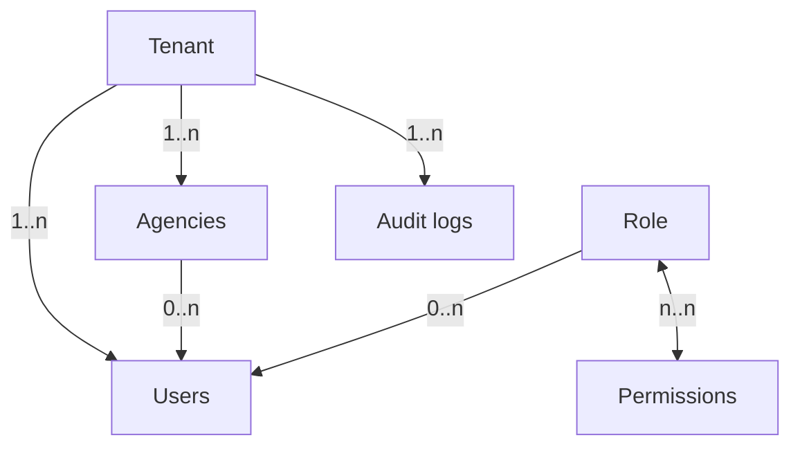

# ADR 0002 — Multitenance partagée et contexte serveur

## Statut

Accepté pour le lot 01.

## Décision

RentFleet utilise une base PostgreSQL partagée. Chaque ressource métier porte
un `tenant_id` non nul, dérivé du compte authentifié par `TenantContext`.
Le client ne peut ni fournir ni sélectionner librement ce champ.

L’isolation repose sur plusieurs couches complémentaires :

1. `ResolveTenantContext` refuse les comptes sans tenant actif ;
2. `BelongsToTenant` renseigne `tenant_id` à la création ;
3. `TenantScope` filtre toutes les requêtes concernées et se ferme sans contexte ;
4. les policies vérifient tenant, agence et permission ;
5. PostgreSQL garantit les clés étrangères et unicités ;
6. les tests tentent explicitement des accès cross-tenant.

Les platform admins ont `tenant_id = null` et utilisent exclusivement des
routes `/platform/*`. Un Tenant Owner peut avoir `agency_id = null`. Les autres
utilisateurs opérationnels sont rattachés à une agence.

## Alternatives écartées

- package externe de multitenance : coût et abstraction inutiles pour le PFE ;
- base séparée par tenant : exploitation trop lourde pour le délai ;
- Row Level Security : reportée, car le socle applicatif est testé et explicite.

## Conséquences

Tout nouveau modèle métier devra utiliser `BelongsToTenant`, une policy et des
tests cross-tenant. Le scope global ne dispense jamais des contrôles
d’autorisation ou des contraintes de base.
