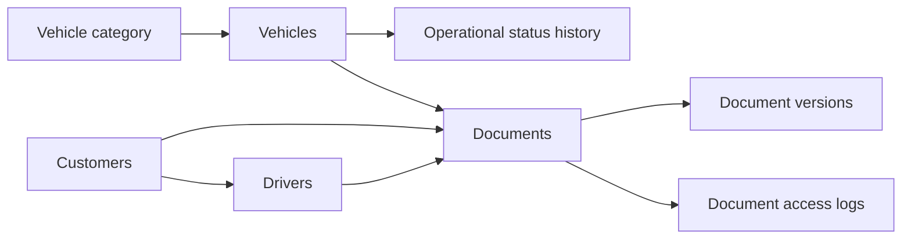

# ADR 0003 — Documents privés et données sensibles

## Statut

Accepté pour le lot 02.

## Décision

Les numéros d’identité client et de permis ne sont jamais stockés en clair.
`IdentityProtector` normalise la valeur, la chiffre avec le chiffrement Laravel
et calcule une empreinte HMAC incluant le tenant. La valeur chiffrée est cachée
de la sérialisation et les listes utilisent uniquement une forme masquée.

Les documents sont écrits sur le disque `local`, dont la racine est
`storage/app/private`. Le mode de service direct du disque est désactivé.
Chaque version reçoit un chemin aléatoire généré côté serveur, un SHA-256, le
MIME détecté et la taille. Aucun chemin proposé par le client n’est accepté.

Le téléchargement passe par une policy et `DownloadPrivateDocument`, puis
crée un `document_access_log`. Les suppressions physiques sont reportées ; le
document métier utilise le soft delete.

## Conséquences

- une fuite de base ne révèle pas directement les identifiants ;
- la recherche d’égalité reste possible dans un tenant via l’empreinte ;
- la rotation de clé et la politique de rétention devront être planifiées ;
- les antivirus externes et la suppression physique différée restent hors lot.
