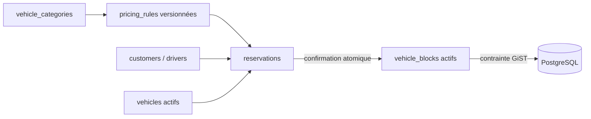
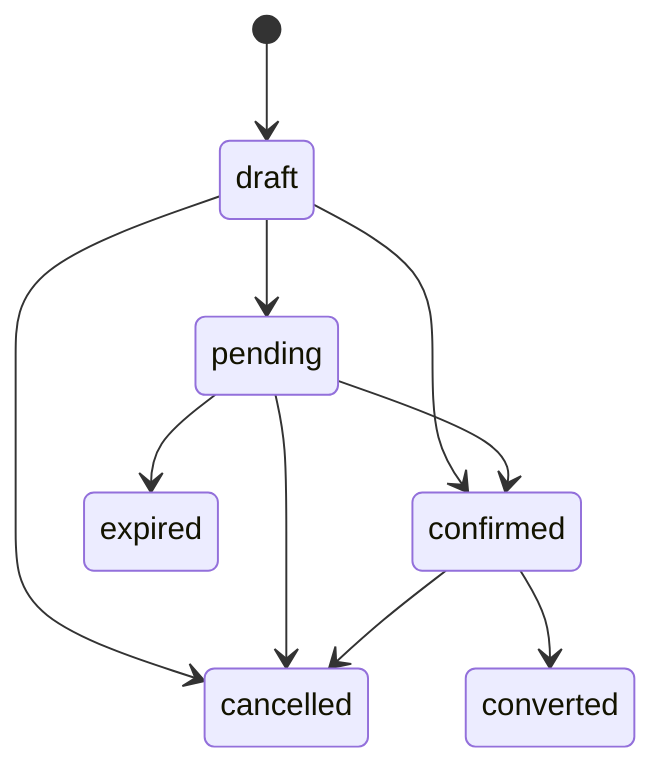

# ADR 0004 — Réservations et concurrence PostgreSQL

## Statut

Accepté pour le lot 03.

## Décision

`vehicle_blocks` est l’unique source de vérité de disponibilité. Le statut
opérationnel d’un véhicule indique s’il est réservable, mais ne décrit pas son
occupation temporelle. Aucun booléen `available` n’est stocké sur `vehicles`.

Les périodes sont des timestamps avec timezone et suivent la convention
semi-ouverte `[début, fin)`. PostgreSQL interdit deux blocs actifs qui se
chevauchent pour le même couple `(tenant_id, vehicle_id)` grâce à une contrainte
d’exclusion GiST nommée `vehicle_blocks_no_active_overlap_excl` :

```sql
EXCLUDE USING gist (
    tenant_id WITH =,
    vehicle_id WITH =,
    tstzrange(starts_at, ends_at, '[)') WITH &&
)
WHERE (status = 'active');
```

La contrainte exige `btree_gist`. La migration crée l’extension si nécessaire
mais ne la supprime pas au rollback.



## Machine à états



Chaque transition crée un `reservation_status_history`. Une réservation
confirmée fige son tarif dans `pricing_snapshot` et crée au plus un bloc actif.
Une annulation libère ce bloc dans la même transaction. Une réservation
`converted` reste bloquante jusqu’à sa reprise par le contrat au lot suivant.

La confirmation verrouille la réservation, vérifie les relations tenant/agence,
le conducteur, le véhicule et le tarif, puis tente l’insertion du bloc. Une
violation `23P01` annule toute la transaction et devient le message métier
« Véhicule déjà indisponible sur cette période. » sans exposer le SQL.

Les numéros `RES-AAAA-NNNNNN` utilisent un compteur PostgreSQL atomique par
tenant et année avec `INSERT … ON CONFLICT … DO UPDATE … RETURNING`. Ils ne
dépendent pas de `max(id)+1`.

## Conséquences

- la double réservation reste impossible même par insertion SQL directe ;
- la recherche applicative améliore l’expérience, mais la contrainte demeure
  l’autorité finale en concurrence ;
- le snapshot confirmé n’est pas affecté par une nouvelle version tarifaire ;
- le contrat devra reprendre le bloc d’une réservation convertie au lot 04.
