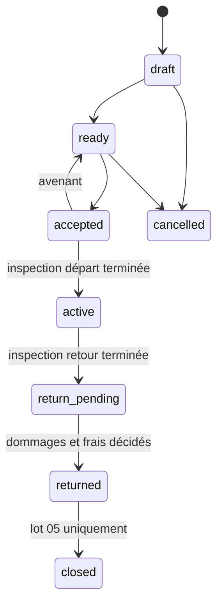

# ADR 0005 — Versionnement et acceptation des contrats

## Statut

Accepté pour le lot 04.

## Décision

Un contrat est créé uniquement depuis une réservation `confirmed`. La
transaction verrouille la réservation, copie ses montants confirmés, crée la
version initiale, transforme le bloc existant de `reservation` vers `contract`
et passe la réservation à `converted`. Aucun tarif n’est recalculé et aucun
second bloc n’est créé.

Chaque version contient quatre snapshots JSON (`terms`, `pricing`, `customer`,
`vehicle`). Les clés sont triées récursivement avant encodage ; SHA-256 est
calculé sur cette représentation canonique. Les données d’identité sensibles
sont masquées et aucun chemin documentaire privé n’entre dans le snapshot.

L’acceptation référence une version précise et enregistre méthode, version du
texte de consentement, date, IP et user-agent. Elle verrouille la version au
niveau PostgreSQL. Une mise à jour ou suppression SQL d’une version verrouillée
échoue. Un avenant ne modifie pas cette version : il crée une version suivante,
repasse le contrat à `ready` et exige une nouvelle acceptation.

Cette preuve de consentement est adaptée au périmètre PFE. Elle ne constitue
pas une signature électronique qualifiée.

## Machine à états

Le trigger `rental_contracts_prevent_closed_before_finance` interdit `closed`
pendant le lot 04. Les contrats acceptés, actifs, en retour ou retournés ne
peuvent pas être supprimés physiquement.

## Conséquences

- une réservation ne produit qu’un contrat non annulé ;
- la version acceptée peut être prouvée par son empreinte sans exposer son contenu ;
- l’historique d’acceptation est conservé lors d’un avenant ;
- la clôture financière reste découplée jusqu’au lot 05.
