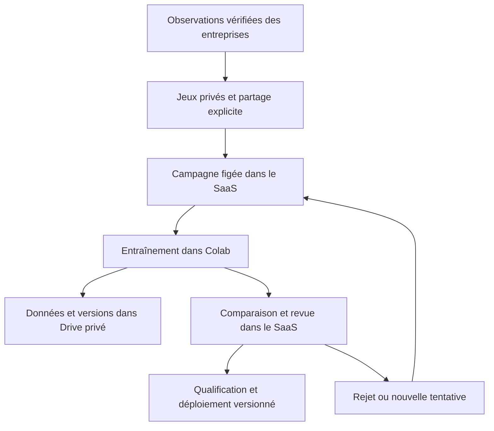

# Réentraîner les modèles avec les données du SaaS

L’architecture retenue associe **un atelier dans le SaaS, Colab pour le calcul et un Drive privé pour les données et les poids**. Le serveur Laravel prépare et contrôle les campagnes ; il ne charge pas de modèle transmis par un utilisateur et ne lance pas de calcul GPU.



Colab est adapté aux sessions interactives ; sa disponibilité et ses ressources varient. Le bouton de l’administration **prépare une session et ouvre le notebook**. Il ne prétend pas démarrer une tâche Colab distante garantie. Une exécution entièrement automatique nécessiterait ensuite un service de calcul dédié avec authentification, budget, queue et suivi des tâches. [FAQ officielle Colab](https://research.google.com/colaboratory/faq.html).

## Ce qui est disponible

| Fonction | Entrées | Recette | Comparaison |
|---|---|---|---|
| Demande | Départs réellement observés chaque jour, par agence | HGB Poisson, horizons J+1 à J+7 ; 28 modèles de quantiles | MAE globale et par horizon ; WAPE si la somme des observations est positive |
| Anomalies d’usage | Retard, distance par jour, baisse de carburant, observation humaine 0/1 | MAD figé sur l’apprentissage ; challenger Isolation Forest | F1 et rappel de chaque classe |
| Couleur | Images vérifiées, huit couleurs et classe de rejet | MobileNet V3 Large/ImageNet ou ajustement d’un checkpoint compatible, sélection sur validation | Exactitude des neuf classes, avant politique d’abstention |
| Dommages | Images, boîtes normalisées confirmées, exemples sans dommage | RT-DETRv2-S, transfert depuis un checkpoint approuvé | F1, précision et rappel à IoU 0,50, avec NMS identique |
| Plaque | Recadrages de plaque et transcription humaine canonique | Reconnaissance arabe PaddleOCR, architecture/dictionnaire approuvés | Transcription complète du recadrage, normalisée par le parseur existant |

La référence anomalies de cette expérience est **MAD recalibré sur l’apprentissage**, et non le classement opérationnel qui recalcule ses statistiques sur chaque lot. Le score OCR ne qualifie pas le détecteur de plaque ni l’ensemble de la chaîne ANPR. La recette dommages vise RT-DETRv2, pas l’ancien classificateur EfficientNet. Les mesures ne sont donc pas interchangeables avec les anciens résultats de qualification.

OR-Tools résout un problème d’optimisation : il faut le requalifier sur de nouveaux scénarios, pas le réentraîner. CatBoost, déjà rejeté, n’est pas réactivé.

## 1. Préparer les données dans l’entreprise

Le **Tenant Owner disposant de `prediction.export`** ouvre **Données d’apprentissage**. Un responsable limité à une agence ne peut pas contribuer au nom de l’entreprise.

Pour la demande, choisir une agence autorisée et une période terminée de **120 à 731 jours**. Le SaaS reprend la sélection canonique des départs réels, inclut les jours sans départ et fige le résultat dans un jeu privé avec son empreinte. Les noms, contrats et identités des clients ne sont pas exportés. Préférer un historique assez long pour observer plusieurs situations ; 120 jours permettent un premier entraînement, mais ne suffisent pas nécessairement aux critères de revue.

Pour les autres données, importer un index JSON de **5 Mo et 20 000 observations maximum**. Les formats sont téléchargeables dans l’interface. Décrire l’origine et la vérification, puis confirmer les droits d’usage et les annotations. Les suggestions d’un modèle ne deviennent jamais automatiquement la vérité terrain : une acceptation de couleur ne remplace pas une étiquette corrigée ; une revue « zone candidate confirmée » ne fournit pas à elle seule toutes les boîtes d’un détecteur.

Les jeux sont privés par défaut. Le responsable peut autoriser explicitement leur utilisation par la plateforme pour des campagnes regroupées dans Colab et Drive privé, lors de la création ou ultérieurement. Ce consentement et son auteur sont tracés. Les données et annotations restent figées ; une correction crée un nouveau jeu.

### Données supplémentaires

Le script `scripts/intelligence/training/prepare_dataset.py` transforme un CSV annoté en `dataset.json` et, pour la vision, un dossier `images_verifiees`. Il ne collecte aucune donnée distante, ne crée aucune annotation et refuse d’écrire les données dans un dépôt Git.

```bash
python scripts/intelligence/training/prepare_dataset.py \
  --csv /chemin/prive/annotations.csv \
  --family color \
  --image-root /chemin/prive/photos \
  --output /chemin/prive/contribution-2026-09
```

Importer `dataset.json` dans le SaaS et conserver les images dans le Drive privé choisi pour la campagne. La validation complète est réalisée à l’import puis à la préparation Colab. En cas de correction du CSV, choisir un nouveau dossier de sortie.

| Famille | Colonnes du CSV, séparateur `;` par défaut |
|---|---|
| Toutes | `key`, `group` : clés stables, sans identité directe, caractères alphanumériques, `_` ou `-` |
| `demand` | `date` (`YYYY-MM-DD`), `value` (entier positif ou nul) |
| `anomaly` | `date`, `late_hours`, `km_per_day`, `fuel_drop_pct`, `label` (`0` normal, `1` anomalie confirmée) |
| `color` | `image` (chemin relatif), `label` (`black`, `blue`, `gray`, `green`, `orange`, `red`, `white`, `yellow`, `__reject__`) |
| `damage` | `image`, `boxes` : tableau JSON de boîtes `x,y,w,h` normalisées dans `[0,1]` ; `[]` pour un négatif vérifié |
| `plate` | `image` (recadrage), `label` canonique, par exemple `12345|أ|6` |

Un `group` représente le même véhicule ou dossier indépendant **dans toutes les contributions**. Plusieurs prises de vue, copies, recadrages et augmentations d’un même véhicule gardent ce groupe. Les clés `key` doivent être distinctes entre sources de l’entreprise. Le serveur pseudonymise les clés et groupes avec le secret d’export déjà configuré ; ne pas faire tourner cette clé pendant une série de campagnes sans revoir les regroupements.

Les images restent privées. Leurs noms sont leurs SHA-256 ; les formats admis sont JPEG, PNG et WebP, au plus 8 Mio et 8 000 pixels par dimension. Les boîtes se rapportent à l’image affichée après correction de l’orientation EXIF. Colab contrôle les empreintes, retire les métadonnées et produit des images PNG sans perte, des annotations COCO ou des index OCR. Les séparateurs `|` du format canonique ne sont pas appris comme caractères OCR ; le parseur rétablit le format.

## 2. Préparer une campagne depuis l’administration

Ouvrir **Réentraînement des modèles**, sélectionner **un à dix jeux du même modèle**, puis **Préparer la session Colab**. La plateforme ne voit que les contributions explicitement partagées d’entreprises actives. Elle ne parcourt pas leurs tables de clients, documents ou locations pour constituer un jeu.

Une campagne accepte 60 à 20 000 observations distinctes (5 000 images au maximum pour les dommages), avec au moins dix observations par partition. Les doublons exacts sont retirés ; les contradictions de groupes, dates, annotations ou clés sont bloquées.

- Demande : séries quotidiennes complètes et bornes temporelles communes à toutes les agences, environ 60 % apprentissage / 20 % validation / 20 % test. Les périodes des agences doivent être compatibles : chacune conserve au moins 60 jours d’apprentissage, dix de validation et dix de test. Chaque exemple est construit uniquement avec l’historique connu à la date de coupure de son horizon.
- Vision et anomalies : groupes stables répartis approximativement 60/20/20 par une empreinte déterministe. Un groupe ne peut pas traverser les partitions. Les mêmes groupes gardent leur partition lors des relances.

Les transformations sont apprises sur `train`, les hyperparamètres sur `validation`. Le test sert à la comparaison finale. Les partitions ne dispensent pas de vérifier que les nouvelles données n’appartenaient pas déjà à l’apprentissage du modèle de référence. [Prévention officielle des fuites de données scikit-learn](https://scikit-learn.org/stable/common_pitfalls.html).

Télécharger le manifeste privé, puis ouvrir le notebook `notebooks/model_retraining_workbench.ipynb`. Avant fusion de la PR, sélectionner `feature/model-retraining-workbench` dans `CODE_REF`. Après fusion, `main` convient ; le notebook enregistre le commit effectivement utilisé.

## 3. Exécuter Colab et conserver les versions

Le notebook guide sept étapes : Drive, code, manifeste, fichiers privés, environnement, entraînement, comparaison/import. Choisir un dossier Drive dont l’accès est privé. Le montage et les accès Google sont réalisés par l’opérateur dans sa session ; aucun token Google n’est stocké par Laravel.

Organisation proposée :

```text
RentFleet_PFE/reentrainement/
  references/              modèles de référence et inventaires approuvés
  sources/                 checkpoints et configurations d’apprentissage
  images_verifiees/        photos nommées par leur empreinte
  <campagne>/<version>/    manifeste, préparation, paramètres, poids et rapport
```

Pour le tabulaire, le notebook crée un Python 3.12 isolé avec `uv` et les versions existantes du projet : NumPy 2.0.2, pandas 2.2.2, scikit-learn 1.6.1 et joblib 1.5.3. La référence J5 est vérifiée par empreinte **avant** `joblib.load`. Un fichier pickle/joblib inconnu ne doit jamais être chargé. [Persistance des modèles scikit-learn](https://scikit-learn.org/stable/model_persistence.html).

La couleur peut réutiliser un checkpoint PyTorch compatible : renseigner `checkpoint`, son empreinte approuvée et `fine_tune_color=true`. Le fichier doit contenir `state_dict` et les neuf `classes` dans l’ordre du contrat. Un fichier ONNX seul ne permet pas cet ajustement ; sans checkpoint compatible, la recette réapprend depuis ImageNet.

La vision réutilise les environnements S7 : PyTorch/TorchVision compatibles avec le GPU pour couleur/dommages ; Paddle dans son environnement séparé pour la plaque. Les versions réellement exécutées sont enregistrées. Les recettes de vision demandent des images annotées et les poids sources de confiance : elles ne fabriquent pas ces données et ne garantissent pas une session GPU disponible.

RT-DETR utilise le checkout officiel déjà approuvé `068dfde65f2667ad6555883c69d73de886518cad`. Le notebook vérifie le checkout et l’empreinte du checkpoint fourni. L’export matériel du modèle candidat reste séparé des installateurs figés du modèle en service. [Source officielle RT-DETR](https://github.com/lyuwenyu/RT-DETR/tree/068dfde65f2667ad6555883c69d73de886518cad/rtdetrv2_pytorch).

PaddleOCR réutilise une configuration arabe de reconnaissance, un dictionnaire et un checkout approuvés. Le jeu de validation remplace seulement les données d’évaluation de l’entraîneur ; le test final n’y est pas injecté. Fournir un inventaire JSON des fichiers de l’export de référence et son SHA-256 pour l’évaluation. [Module de reconnaissance PaddleOCR](https://www.paddleocr.ai/main/en/version3.x/module_usage/text_recognition.html).

Le rapport JSON est borné à 5 Mo ; les recettes le produisent sans indentation inutile. Les sorties comprennent `campaign.json`, `session-config.json`, `training-started.json`, les choix de validation, les poids candidats et `report.json`. Une session existante n’est pas écrasée. Pour les dommages et l’OCR, sélectionner le checkpoint uniquement sur la validation puis exécuter l’export/comparaison. Conserver les sorties privées, même lorsqu’elles contiennent seulement des recadrages ou des transcriptions de plaques.

## 4. Comparer et décider

Importer `report.json` sur la page de la campagne. Le SaaS contrôle la campagne, l’empreinte exacte du manifeste, la référence, l’unicité du résultat et la couverture exacte du test. Il recalcule les scores à partir des prédictions et des annotations figées : le fichier ne peut pas fournir un simple indicateur « réussi » ni omettre les exemples difficiles. Les prédictions sont déclarées par l’opérateur ; le serveur **ne prouve pas** qu’elles proviennent effectivement des poids désignés.

Les critères initiaux sont des garde-fous de revue, pas une preuve de significativité statistique :

- Au moins 30 observations de test ; au moins cinq par classe présente.
- Demande : baisse de MAE d’au moins 5 %, aucun horizon dégradé de plus de 2 %.
- Classification/OCR/anomalies/dommages : gain d’au moins un point, sans baisse de rappel par classe supérieure à deux points.
- Couleur : neuf classes présentes dans le test. Anomalies : usages normaux et anomalies confirmées.
- Dommages : au moins dix positifs et dix négatifs ; précision et rappel ne doivent pas reculer de plus de deux points. L’appariement des boîtes est univoque à IoU 0,50.

Un administrateur peut **rejeter** le candidat ou le **retenir pour qualification technique**, avec un motif immuable. Les chiffres historiques publics ne sont pas recopiés comme performance du candidat.

La qualification technique reste nécessaire : calibration et abstention, couverture des intervalles de demande, précision/rappel/AP de détection, robustesse par classe/agence, latence, mémoire, compatibilité du contrat d’inférence et recette sur le domaine RentFleet. Le seuil couleur exporté est un repère de compatibilité, pas un nouveau seuil calibré. Une amélioration sur un échantillon n’autorise pas automatiquement une activation.

## 5. Intégration, retour arrière et révocation

L’atelier ne remplace pas les artefacts en service. Après qualification, une PR technique met à jour la version du modèle, les empreintes, métadonnées/cartes, adaptateurs si nécessaire et tests de compatibilité. Le déploiement utilise les installateurs privés existants, d’abord désactivé ou en mode consultatif, avec recette avant activation. Conserver la version précédente et son environnement pour le retour arrière.

Une révocation est définitive pour le jeu concerné. Elle bloque les téléchargements, imports, relances et revues favorables de toutes ses campagnes. Une suspension d’entreprise a le même effet tant qu’elle dure. Les décisions et résultats déjà enregistrés restent consultables pour l’audit. Les copies déjà téléchargées, les entraînements Colab en cours et les poids déjà déployés exigent une intervention de l’opérateur ; aucun effacement à distance n’est prétendu.

L’ajout de données n’entraîne aucun paiement, décision de responsabilité, modification de contrat, changement de disponibilité ou sanction automatique. Les suggestions des modèles restent consultatives.

## Installation et vérification

Appliquer la migration avec le déploiement Laravel habituel, puis reconstruire les assets. Aucun package Composer, service Redis, worker GPU ou accès SQL externe supplémentaire n’est requis. Le disque `intelligence-private` et `INTELLIGENCE_EXPORT_HMAC_KEY` doivent déjà être configurés comme pour les exports Intelligence. Ne jamais mettre cette clé dans Drive.

`MODEL_TRAINING_NOTEBOOK_URL` peut pointer vers une copie privée Colab du notebook ; le lien doit commencer par `https://colab.research.google.com/`. Sans configuration, le lien GitHub du projet est utilisé. Aucun secret n’est nécessaire dans cette URL.

```bash
php artisan migrate --force
php artisan optimize:clear
npm ci
npm run build
php artisan test --filter='SaasModelTraining|TrainingEvaluation'
python -m unittest tests/Python/test_training_workbench.py
```

Les tests PHP utilisent PostgreSQL. Les tests Python comprennent un vrai petit entraînement HGB et Isolation Forest **sur des données fictives**, la séparation temporelle/des groupes, l’intégrité, l’absence de métadonnées d’image et la couverture exacte du test. Ils ne constituent pas un entraînement de production ni une qualification des nouvelles versions GPU sur les photos privées.
